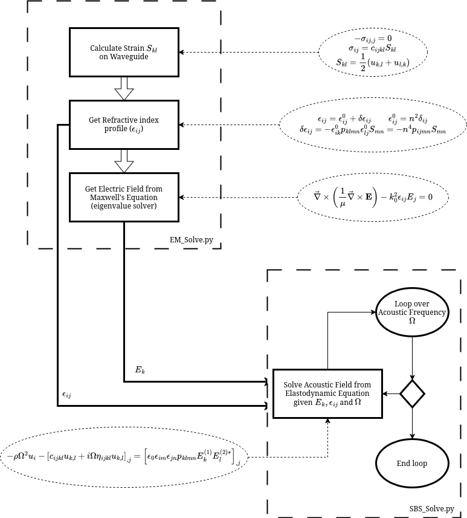

# brillouin_fibre

## Acousto-optics in Optical Waveguides under Mechanical Stress

[brillouin_fibre](https://github.com/goto-20/brillouin_fibre) is a simulation environment for calculating Stimulated Brillouin Scattering (SBS) within a 2-D Optical Waveguide in the presence of external mechanical load. It is built over the [FEniCS](https://fenicsproject.org/) computing platform for solving partial differential equations (PDEs) with the finite element method (FEM). [brillouin_fibre](https://github.com/goto-20/brillouin_fibre) combines the linear elastic equation, Maxwell's equations and the elastodynamic equations to fully characterize optical waveguides built from any material. The sequence can be described with the following workflow:

