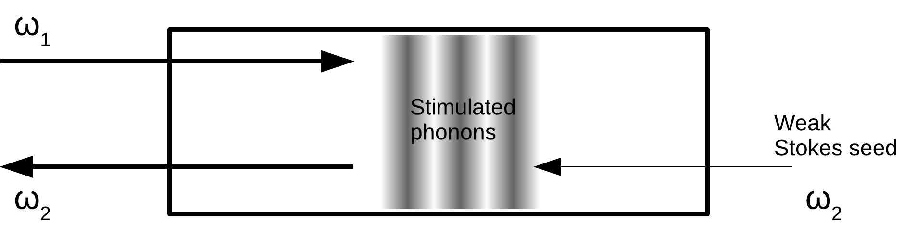
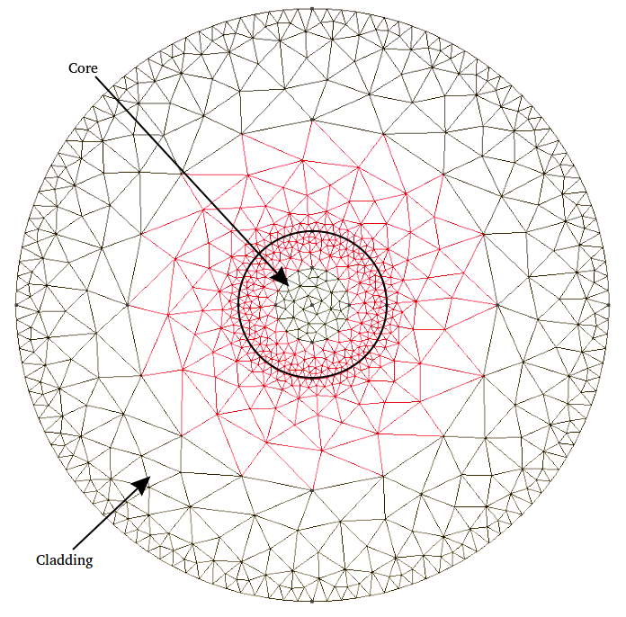
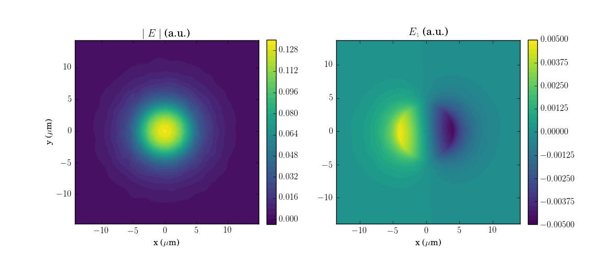
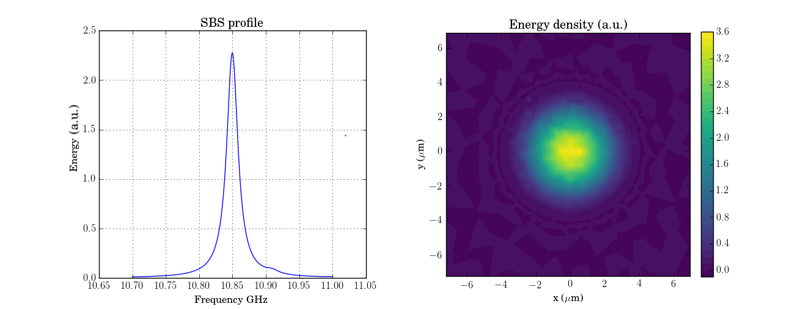
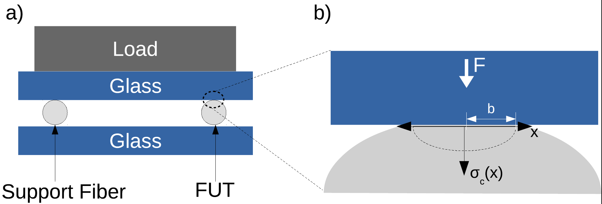
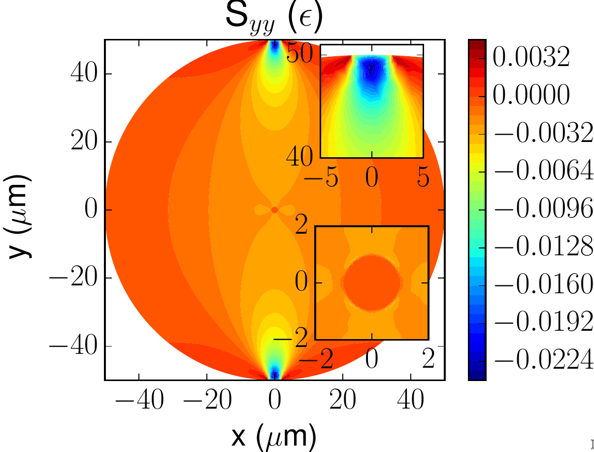
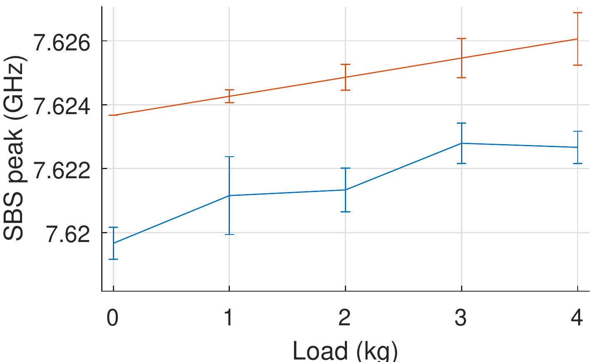

# brillouin_fibre

## Acousto-optics in Optical Waveguides under Mechanical Stress

[brillouin_fibre](https://github.com/goto-20/brillouin_fibre) is a simulation environment for calculating Stimulated Brillouin Scattering (SBS) within a 2-D Optical Waveguide. SBS can be described as the process of exciting acoustic waves within a waveguide using two counter-propagating waves.

    

[brillouin_fibre](https://github.com/goto-20/brillouin_fibre) combines the linear elastic equation, Maxwell's equations and the elastodynamic equations to fully characterize optical waveguides built from any material in the presence of static mechanical load. The worflow for the simulation is as follows:

    

The simulation environment is built over the [FEniCS](https://fenicsproject.org/) computing platform for solving partial differential equations (PDEs) with the finite element method (FEM).

## Examples

### Single-Mode Fiber (SMF-28) (Silica)

First, we make sure that the SBS process for SMF-28 is in agreement with known experimental values. The waveguide is built using the [gmsh](https://gmsh.info/) library to build a core and a cladding region within the waveguide. We also include mesh-refining around the boundary conditions (outer perimiter, and between the core-cladding region).

    

Plugging in the material constants for SMF-28 (Appendix below), we get the following Electric Field distribution:

    

which when subjected to a Pump and Stokes Wave, gives rise to the following SBS spectrum (left), and the acoustic wave distribution (right):

    

### Chalcogenide-PMMA fibers

Known for their high sensitivity to mechanical load, we simulate SBS for the Chalcogenide-PMMA fibre (Chalcogenide core with PMMA cladding) under external mechanical load, making full use of the features of [brillouin_fibre](https://github.com/goto-20/brillouin_fibre). We assume two pressure points on the fiber due to the experimental setup below:

    

which gives rise to the following strain tensor distribution (only plotting $S_{yy}$) that impacts the refractive index near the core of the material:

    

Plugging in the material constants (Appendix Below), we can then characterize the shift in the SBS peak as a function of net load (kg) and compare the results with experimental data (Blue curve):

    

## References
- B. Saxena, [Electrostriction in As2Se3-PMMA Microtapers](https://ruor.uottawa.ca/items/2d06389b-0cbd-4a8a-b387-87a1b95ee676)
- B. Saxena, Chams Baker, Xiaoyi Bao, and Liang Chen, [High birefringent Brillouin frequency shifts in a single-mode As2Se3-PMMA microtaper induced by a transverse load](https://doi.org/10.1364/OL.44.004789), Vol. 44, Issue 19, pp. 4789-4792 (2019)
