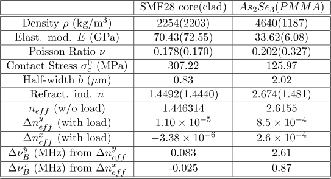

# brillouin_fibre

[brillouin_fibre](https://github.com/goto-20/brillouin_fibre) is a robust simulation environment designed to calculate **Stimulated Brillouin Scattering (SBS)** within a 2D optical waveguide. SBS refers to the process in which acoustic waves are excited within a waveguide via two counter-propagating optical waves.

    

## Simulation Workflow

The [brillouin_fibre](https://github.com/goto-20/brillouin_fibre) framework integrates linear elastic equation, Maxwell's equations and elastodynamic equations, providing a comprehensive tool to characterize optical waveguides made from any material under static mechanical loads. The simulation workflow is as follows:

    

This environment is built on the [FEniCS](https://fenicsproject.org/) computing platform, which leverages the finite element method (FEM) to solve partial differential equations (PDEs).

# Examples

## Single-Mode Fiber (SMF-28) (Silica)

To validate the SBS process for the SMF-28 fiber, we ensure that the simulation results align with established experimental data. The optical waveguide is constructed using the [gmsh](https://gmsh.info/) library, which defines the core and cladding regions. A mesh refinement is applied around the boundary conditions, including the outer perimeter and the core-cladding interface.

    

By incorporating the material constants for SMF-28 (listed in the [Appendix](#appendix)), we obtain the following electric field distribution:

    

When subjected to a pump and Stokes wave, the SBS spectrum (left) and acoustic wave distribution (right) are generated as shown below:

    

## Chalcogenide-PMMA Fibers

Chalcogenide-PMMA fibers are known for their exceptional sensitivity to mechanical stress [[1](#references),[2](#references)]. In this simulation, we explore the SBS phenomenon in a Chalcogenide-PMMA fiber (Chalcogenide core with PMMA cladding) under external mechanical loading, taking full advantage of the features offered by [brillouin_fibre](https://github.com/goto-20/brillouin_fibre). The fiber is subjected to two pressure points, as shown in the experimental setup below:

    

This load induces a strain tensor distribution (shown for $S_{yy}$ only) that alters the refractive index near the core of the fiber:

    

By incorporating the relevant material constants (found in the [Appendix](#appendix)), we can characterize the shift in the SBS peak as a function of the net load (in kg) and compare the results to experimental data (shown as the blue curve):

    

# Appendix

Table of parameters used in the simulations above:

    

# References

1) B. Saxena, [Electrostriction in As2Se3-PMMA Microtapers](https://ruor.uottawa.ca/items/2d06389b-0cbd-4a8a-b387-87a1b95ee676)
2) B. Saxena, Chams Baker, Xiaoyi Bao, and Liang Chen, [High birefringent Brillouin frequency shifts in a single-mode As\(_2\)Se\(_3\)-PMMA microtaper induced by a transverse load](https://doi.org/10.1364/OL.44.004789), *Optics Letters*, Vol. 44, Issue 19, pp. 4789-4792 (2019)
